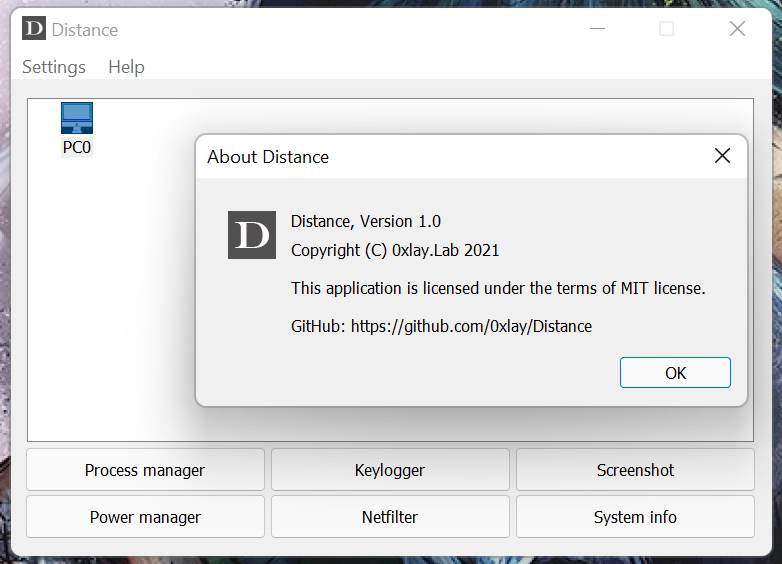

# Distance
The Distance application is intended to control and watching for the educational process.</br>
If a student uses the lab PC for his purposes, the teacher or other responsible person, must block access to the lab PC.



## Dependecies
* [BOOST (JSON, ASIO) version 1.75 or higher][1]
* [WDK 10 or higher][2]
* [MFC][3]
* [XStar][4]
* [Visual Studio 2019 or higher][5]

The project is being developed using C++17.

## Deploy
0. Install WDK and Visual Studio 2019 with MFC
1. Clone ```git clone --recurse https://github.com/0xlay/Distance.git```
2. Build XStar library
3. Download and build BOOST library
4. Set envrionment variable ```_BOOST_LIB_``` with path to BOOST library
5. Build project

[1]: https://www.boost.org/
[2]: https://docs.microsoft.com/en-us/windows-hardware/drivers/download-the-wdk
[3]: https://docs.microsoft.com/en-us/cpp/mfc/mfc-desktop-applications?view=msvc-170
[4]: https://github.com/0xlay/XStar
[5]: https://visualstudio.microsoft.com/ru/vs/
